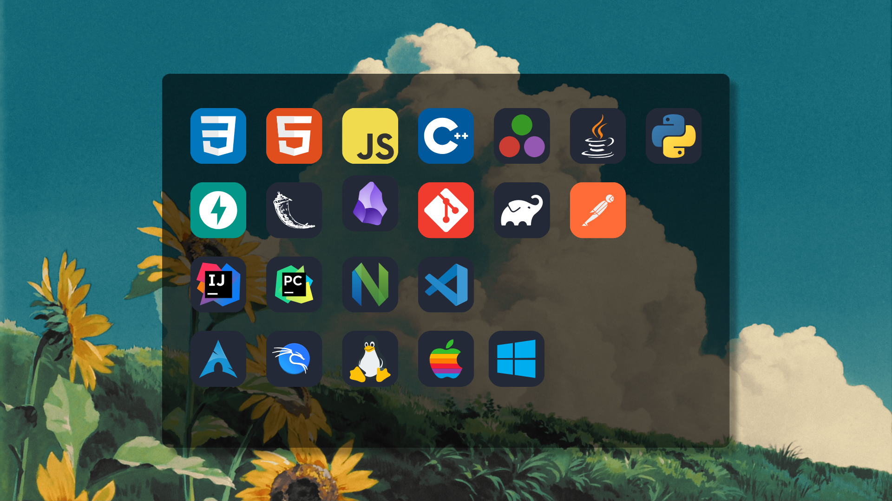

---

  <h1>💻 Programming Languages & Technologies</h1>

---

  <h1>🪣 Tech Stack</h1>

  
  
  
  
  
  
  

   

  
  
  

   

  
  

   

  
  
  
  

   

  
  

  <h1>⚡️ GitHub Stats</h1>

  <!-- Profile Summary Cards -->
  
  
  
  
    

  <!-- WakaTime Card -->
  

